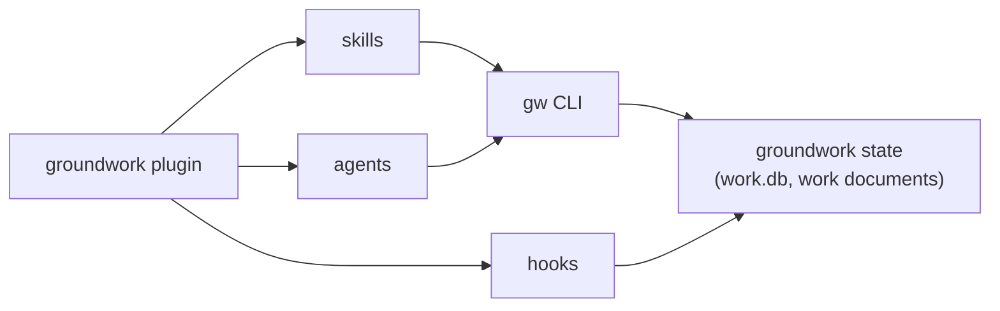

# groundwork

groundwork is a Claude Code plugin that adapts to each repo's conventions, enforces best practice in new code only, and builds known-from-unknown.

It adds:

- **Intent routing**: classifies a request and fans out to the right agent type.
- **Convention adaptation**: detect, confirm, then write to the repo's own files. See [doc/conventions.md](https://github.com/IniZio/groundwork/blob/cc3f4e32aff23bc44798cd668375e8c9ad8e29ec/doc/conventions.md).
- **Work store and stop-gate**: slices, decisions, events and charter in one SQLite file. The stop-gate blocks while work is open.
- **Enforcement hooks**: five families (spawn-model, store-write, piped-exit-code, prose-quality, new-code-gate).
- **Advisor gate**: evidence-graded APPROVE, CORRECTION or STOP verdict before completion.
- **Session continuity**: a SessionStart hook restores context.

## How it fits in a session



State lives in two places only: the repo itself, and one work.db file. `gw init` adds the state directory to the clone's local git exclude list.

## Install

```
claude plugin marketplace add mattpocock/skills
claude plugin marketplace add /path/to/groundwork    # or a URL
claude plugin install groundwork
```

Install pulls in two dependencies: mattpocock-skills and house-rules. Add the `mattpocock` marketplace first, because Claude Code does not add a dependency's marketplace for you ([proof harness](https://github.com/IniZio/groundwork/blob/cc3f4e32aff23bc44798cd668375e8c9ad8e29ec/scripts/proof-harness.sh), `--install-only`).

If the marketplace is missing, install still exits 0 but warns `dependency "mattpocock-skills@mattpocock" was not installed`. `claude plugin list` then shows `Status: ✘ failed to load — Dependency "mattpocock-skills@mattpocock" is not installed — run \`claude plugin install mattpocock-skills@mattpocock\`, or check that its marketplace is added`. Fix: run `claude plugin marketplace add mattpocock/skills`, then `claude plugin install groundwork` again.

house-rules needs Claude Code v2.1.193 or later. On older versions its checks are silently off.

## Peer plugins

- **mattpocock-skills** provides arch-review, prototype, tdd and code-review. See the [collision policy](https://github.com/IniZio/groundwork/blob/cc3f4e32aff23bc44798cd668375e8c9ad8e29ec/doc/collision-policy.md) for skill-name clashes.
- **house-rules** provides comment-density limits (at most 5 net-new comments per 100 lines, checked per edit and at Stop/SubagentStop) and document placement (the `artifact-structure` rule, formerly `stray-artifacts`). Work documents live under a per-slug folder inside the state directory.

## Key decisions

- **Reuse upstream skills.** Alternative rejected: reinvent arch-review, prototype and tdd. The v2 rewrite deleted the home-grown versions as "covered upstream".
- **Write conventions into the repo's own files** (`.gitmessage`, `Makefile`, PR template). Alternative rejected: replace per-repo tooling with groundwork's own.
- **Enforce on new code only.** Alternative rejected: change existing code; it is left alone.
- **One SQLite file for work state.**
- **Ignore the state directory through the local git exclude list.** Alternative rejected: edit the host repo's `.gitignore`.

## Development

```
bun install
bun test
```

### Testing a change live

The `groundwork` marketplace is a `directory` source pointing at this repo. Every session runs the working tree, including uncommitted edits. No reinstall.

- Hook and CLI edits apply on the next hook call.
- SessionStart text, skills and agents need a new session or the reload-plugins command.
- A half-finished edit affects every open session. Commit at wave boundaries.

SessionStart prints the version, git sha and root path. A root under the plugin cache directory means you are not running the dev checkout. The hook finds its root from its own file location. `CLAUDE_PLUGIN_ROOT` is only cross-checked, and a mismatch prints a line.
