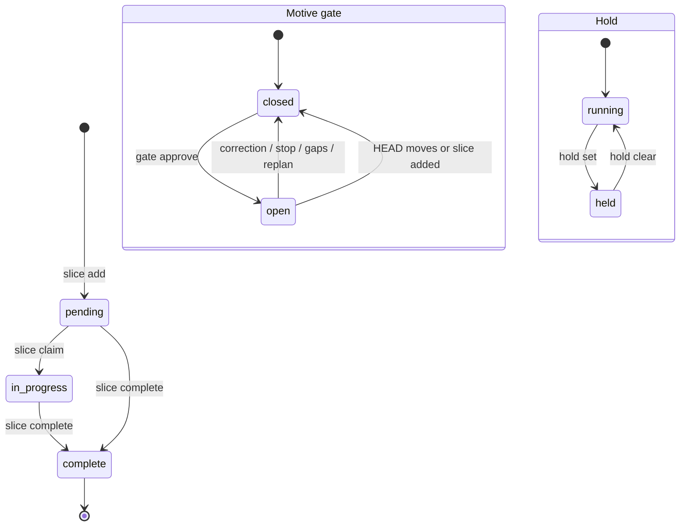

# gw CLI

gw keeps all work state for a repo in one SQLite store. The store is at `$GROUNDWORK_DB`, else the work database inside the repo's working-tier directory.

## Model

- **One store per repo.** Plain files per agent would drift and cannot answer "is this run done?" in one read.
- **Motives.** A motive is one line of work with its own slices, events, and gate. A command targets the active motive, or the one named by `--motive`. The stop-gate checks every active motive that has slices, and blocks if any has open slices or no approval. A hold is the exception: it is store-wide, because it is a session-level signal.
- **Token-guarded writes.** Every mutation needs `--token`, printed once by `gw init` and again by `gw token`. The token and the gate-seal key live outside the repo, so a subagent cannot read them. Rejected: trusting the caller, because a subagent could then approve its own work. Residual risk: a subagent that builds the key path at runtime can evade the string-match guard. Forging an approval needs the seal key, which only `gw gate approve` reads.
- **Gate verdicts are events, not edits.** The newest verdict decides. Rejected: a mutable "done" flag, because it loses who closed the gate and when.

## Command groups

### Gate rules

The stop-hook releases only when the newest verdict for the motive is `approve`. The parent of a delegate child uses the newest forwarded verdict, so a later non-approval supersedes an earlier approval.

`gw gate approve` records the git HEAD SHA. The approval is void if HEAD moved since, or if a slice was added to the motive after it. The stop-gate names which case applies. Uncommitted changes do not void it. Outside a git repo, no HEAD binding applies.

A child tree linked in delegate mode cannot approve while it has uncommitted changes outside the working-tier directory. The command exits 1 and asks for a commit first. Direct-mode links are not checked.

### Intent approvals

A human approves the charter (H1) and the spec (H2) with `gw approve charter` and `gw approve spec`. The approval binds to a hash of the file. Edit the file afterwards and the approval is void, so approve again.

An agent may run `gw approve spec --auto` to pass H2 when no decision is open. Otherwise the command sets a hold whose note starts `H2 needs human approval:`. The human's `gw approve spec` clears that hold.

It exits 1 when the artifact is missing or the subcommand is wrong. It exits 2 when `--auto` hit a case that needs a human.

When the active motive has a charter or spec file in the repo's doc folder, the session cannot dispatch implementation agents until both are approved. The dispatch is refused with a message that names the missing approval.

### Hold

While any motive has a hold, the stop-hook lets the session end. It shows the note once per session and per hold, then stays silent. A new `gw hold set` replaces the note and shows it again. Put "established / still need" in the reason, for example `--reason "established: API shape agreed; still need: prod credentials from ops"`. Clear the hold when the human replies; the run resumes from the paused ledger.

### Compile output

- Intent line: `H1 charter: <state>` and `H2 spec: <state>`, where state is `approved (human)`, `approved (auto)`, `void`, or `missing`. Without a human view for the motive it prints `intent gates: n/a`. In `--json`, `intent` carries the same data.
- Hold line: `hold: awaiting human — <note>` or `hold: none`. In `--json`, `hold` is the note or `null`.
- AC coverage: `ac coverage: N ACs covered by M slice(s)`, then sorted `AC-x: slice-id, ...` rows, or `ac coverage: none`. `--json` adds `ac_coverage`, a map from AC id to slice ids.
- Idle units: `idle units (≥14d): slug (Nd), ...` lists work units whose newest file change is 14 days old or more, else `idle units: none`. `--json` adds `idle_units` as `{slug, idle_days}`.

### Archive checks

`gw archive` changes nothing and exits 1 if a check fails. It moves the unit into a dated archive folder and drops its evidence directory. Checks:

- The unit's motive file has a `created: YYYY-MM-DD` date.
- If the unit has a spec, its frontmatter has `folds_into:`. The named living spec needs a git commit after `created`, or a staged change. To skip, set `folds_into: none` with a `reason:`. `none` without a reason is refused.
- The archive target does not already exist.

### Migrate rules

Default is a dry run: one `<from> → <to>` line per move, nothing changed.

- An old motive folder goes to the work folder, or to the dated archive folder when its `status:` is complete, completed, archived, or done. No `status:` is flagged `[unclassified]`. A missing `created:` date is inferred from file times, flagged `[created inferred]`, and written on apply.
- A scratch feature folder goes to the work folder.
- Loose v1 directories (`handoffs`, `research`, `journal`, `compiled`, `gates`, `runs`, `specs`, `learnings`, old archived motives) and pause-state files go to the legacy archive folder.
- A move whose destination exists is skipped as `[collision: skipped]` and the command exits 1.
- Symlinks and unrecognised entries are never moved. They print as `left in place: <name>`.

### Recipe

Paste the output into a host's house-rules config. Its `govern` list covers only working-tier markdown, so host product docs stay ungoverned. A host that wants to catch stray docs elsewhere must widen `govern` and add its own types. A stray document inside the working tier is denied with the nearest matching types named. The `forbidden` patterns apply repo-wide, each with a redirect to the right place (for example, learning records redirect to the motive's lessons file):

- ADR directories
- scratch and out-of-scope folders
- lessons and learning-records folders
- to-questionnaire files

### Commit-message lint

A hook lints every `git commit` message before it runs, in the style set by the host's house-rules config. It sees direct, prefixed, `-C`/`-c`/`--git-dir` forms, and commits chained after `&&`, `||`, `;`, or `|`. It cannot see a commit run through a shell function alias; a git-level `commit-msg` hook, installed per session, catches those. If `core.hooksPath` is set to a missing directory, the installer warns and does not install.
