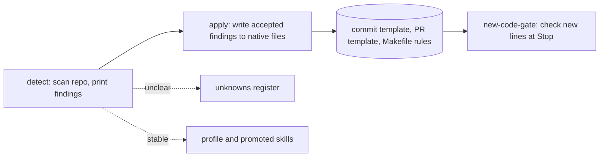

# Conventions: detect, enforce in new code, separate known from unknown

The convention layer reads a repo's existing conventions, writes accepted ones into native repo files, and blocks new code that breaks them.

## Decisions

**Conventions live in the repo's own files, not in groundwork state.** The commit message shape comes from the commit template (it must have a type marker). Code rules come from Makefile comment lines of the form `# groundwork-rule: <name>`. The profile under the working tier can hold a pointer, but it is never the rule source. Rejected: a groundwork-owned rule store, which would hide the rules from people who never run groundwork.

**[Apply](https://github.com/IniZio/groundwork/blob/cc3f4e32aff23bc44798cd668375e8c9ad8e29ec/src/conventions/apply.ts) writes only to an allowed set:** the commit template, the PR template, the Makefile, and a handbook checkout passed with the handbook option (it can sit outside the repo).

**Project instructions are a last resort.** The agent instruction file and the rules folder under the agent config directory are valid targets only when a finding sets `fallback: true`. Rejected: writing every convention to the agent instruction file, which binds only agents and leaves other contributors unaware.

**Handbook changes go through the fork only.** The Oursky handbook is [oursky/handbook-dev](https://github.com/oursky/handbook-dev). Writing into a local checkout is allowed. A PR against that upstream is forbidden; PRs target only the fork [IniZio/handbook-dev](https://github.com/IniZio/handbook-dev). Rejected: opening upstream PRs directly, so a bad automated change never reaches the shared handbook.

## New-code gate

The gate runs on Stop and SubagentStop. "New code" means lines added in the working tree against HEAD, plus every line of untracked files. Rejected: checking the whole repo, which would block work on old debt.

The shipped rules are `no-console-log` (no `console.log(` in new lines) and `no-ts-any` (no `: any` or `as any` in new TypeScript lines).

## Known and unknown

The [known](https://github.com/IniZio/groundwork/blob/cc3f4e32aff23bc44798cd668375e8c9ad8e29ec/src/conventions/known.ts) step creates the working-tier run files and is safe to repeat; it adds to them. The [unknown](https://github.com/IniZio/groundwork/blob/cc3f4e32aff23bc44798cd668375e8c9ad8e29ec/src/conventions/unknown.ts) step appends open questions to an append-only register. The [promote](https://github.com/IniZio/groundwork/blob/cc3f4e32aff23bc44798cd668375e8c9ad8e29ec/src/conventions/promote.ts) step turns a stable convention into a skill in the standard skill format.
