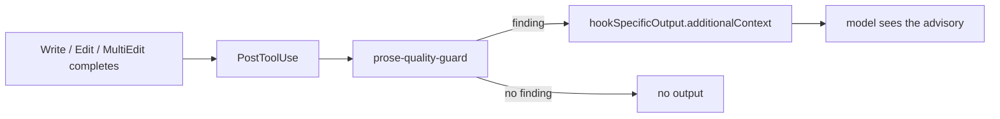

# Enforcement Scope

The [prose-quality guard](https://github.com/IniZio/groundwork/blob/cc3f4e32aff23bc44798cd668375e8c9ad8e29ec/src/hooks/prose-quality-guard.ts) is advisory.

## What the guard checks

- **negation-loss**: a surviving sentence lost `not`, `never`, `no`, `only` or `except`. Prose and agent files only.
- **hedge-upgrade**: `may`, `could`, `sometimes`, `might`, `appears to` or `is likely to` became `will`, `does` or `always`. Prose and agent files only.
- **abbreviation**: a banned shorthand (`cfg`, `fn`, `req`) appeared, or a domain acronym (`AC`, `TBD`, `TBR`, `impl`) was expanded. Code blocks are ignored.
- **slop**: a comment opens with an AI-fingerprint phrase (`// Let's`, `// Now we`, `// Step 1`). Applies to every write target.

## What it deliberately does not check

- **Comment restatement.** Rejected: a check that compares each comment with the file's other comments. It needs a cross-file similarity pass, fails only occasionally, and flags too many doc comments wrongly.
- **Mid-sentence slop.** Rejected: matching filler anywhere in a line. It flags legitimate technical prose. Matching comment openers only catches the most common failure at low false-positive cost.
- **Orchestrator writes.** Rejected: a hook that blocks Write and Edit by the orchestrator. The orchestrator's tool list has no Write, Edit or MultiEdit, so a hook would only repeat the allowlist.
- **Hints when a skill loads.** Rejected: injecting guidance at skill load. A skill the user types bypasses PreToolUse, so a hook cannot cover it reliably.
- **Comment density and document placement.** Not in this guard. The `house-rules` plugin owns them.

## Deployed path

| Hook | Event | Output |
|---|---|---|
| piped-exit-code-guard | PreToolUse (Bash) | deny with reason |
| spawn-model-guard | PreToolUse | deny, or allow with optional `updatedInput` |
| store-write-guard | PreToolUse | deny, or empty output to allow |
| prose-quality-guard | PostToolUse | `additionalContext` only |
| stop-gate | Stop | `decision: "block"` with reason, or `continue: true` |
| new-code-gate | Stop, SubagentStop | `decision: "block"` with reason, or `continue: true` |

### Spawn guard

The spawn-model-guard also refuses to dispatch implementation agents (implementer, junior-orchestrator, designer) until the charter and spec are approved, when the work unit has a human view in its own `doc` folder. It allows the spawn when the store is absent or the check errors.
### Block bounds

- **stop-gate** releases after four consecutive blocks. Blocks 1 and 2 name the fix. Block 3 says the problem is externally unresolvable. Block 4 allows the stop with a stderr warning and resets the counter. A HOLD event with no later HOLD_CLEAR allows at once, because a human hold is a legitimate stop.
- **new-code-gate** has no bound. If a violation cannot be fixed in the session, it keeps blocking after stop-gate releases.

## Document placement

The `house-rules` `artifact-structure` rule (alias: `stray-artifacts`) enforces where documents go, using the doc-type manifest in the house-rules config. Without `types` or `forbidden` in the manifest, placement is not enforced; only the legacy synonym-directory and root-scratch checks run. See the [house-rules README](https://github.com/IniZio/groundwork/blob/cc3f4e32aff23bc44798cd668375e8c9ad8e29ec/plugins/house-rules/README.md).

- **Edit time** (new files only, PreToolUse on Write, Edit, MultiEdit): a path that matches `forbidden`, or a governed path that matches no type, is denied. The message names the correct location. A path that matches a type passes, because a fresh write is a draft.
- **Stop and SubagentStop**: path, frontmatter and heading checks run on new files, including files created through Bash.
- **Ignored files are still checked.** `forbidden` patterns and type-matched paths are enforced even when git ignores the file. The git exclusion that `gw init` writes for the working directory therefore does not exempt working-tier files. An ignored path that matches no type is enforced only under a typed area, meaning the literal prefix of a type's `generates` pattern up to the first brace, cut at the last slash (the working-tier directory, for example). Ignored paths outside every typed area, such as build output, are exempt.
- **Commit messages**: commit-lint rejects motive slugs and process vocabulary ("gate cycle", "dogfood cleanup", "advisor APPROVE", slice ids, decision ids) on any line. It also rejects violations of the commit-message preset.
- **Session start**: the "Where docs go" table lists the doc types, from the manifest or from the built-in registry (marked not enforced).
