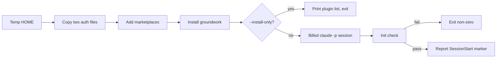

# Proof Harness

The [proof harness](https://github.com/IniZio/groundwork/blob/cc3f4e32aff23bc44798cd668375e8c9ad8e29ec/scripts/proof-harness.sh) shows that groundwork loads the way a user gets it: installed from a plugin registry into a fresh, isolated HOME. It checks the session's `init` event before anyone interprets any behaviour from the run.

## Why not `--plugin-dir`

`claude --plugin-dir` is the obvious way to test a local plugin, and it is unusable here. It silently drops any plugin whose manifest declares `dependencies`, and groundwork depends on mattpocock-skills. With the key removed, groundwork and its four agents appear; with it present, they do not.

## Options

Claude Code does not add a dependency's marketplace for you. `--no-dep-marketplace` skips adding it, and with `--install-only` install exits 0 with a warning that `mattpocock-skills@mattpocock` was not installed, and groundwork shows `failed to load`. With the marketplace added, all three plugins show `enabled`.

`--plugin` copies the directory as is, untracked files included. A `node_modules` holding a broken symlink fails install with `ENOENT ... symlink`. Pass a clean export of the tree instead.

## Init check

The harness reads the first `system`/`init` line of `stdout.log` and fails, exiting non-zero, unless:

- groundwork is listed at exactly the version in package.json, and at no other version.
- mattpocock-skills is listed.
- The agents advisor, implementer, orchestrator, and qa are listed.

It then reports whether the [SessionStart hook](https://github.com/IniZio/groundwork/blob/cc3f4e32aff23bc44798cd668375e8c9ad8e29ec/src/hooks/session-start.ts) text is `PRESENT` or `ABSENT`.

## Auth caveat

A fresh HOME has no credentials. The harness copies only two files from your Claude config directory: the OAuth credentials file and the account-identity file. It leaves installed plugins, settings, MCP config, and hooks behind, so the baseline is clean. If neither file exists, `claude` prompts for login; the harness warns and continues.

## The `GW=` path differs from a real install

The SessionStart hook injects a `GW=` line built from `CLAUDE_PLUGIN_ROOT`. In a harness run that is your checkout. For a real user it is the versioned install cache, which already holds the correct path, so no manual PATH step is needed.
