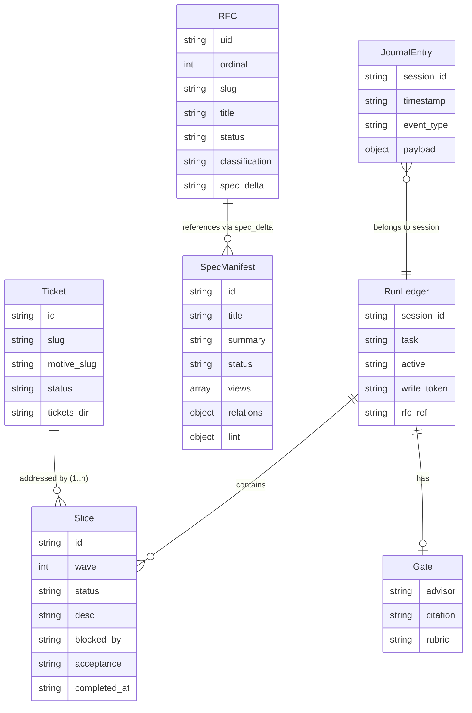

# Artifact Data Model

## Run Ledger fields

| Field | Type | Description |
|---|---|---|
| `session_id` | string | Unique identifier for the session that created this ledger |
| `task` | string | Human-readable description of the run's goal |
| `slices` | Slice[] | Ordered list of work slices tracked in this run |
| `gate` | Gate | Advisor verdict record; `null` until gate is recorded |
| `active` | boolean | Whether this run is still in progress |
| `write_token` | string | Opaque token required by ledger CLI to mutate this ledger |
| `rfc_ref` | string? | Optional path to the motivating RFC directory |

## Ticket fields

| Field | Type | Description |
|---|---|---|
| `id` | string | Unique identifier for the ticket (e.g. `tkt-redesign-auth`) |
| `slug` | string | Kebab-case file stem used as the on-disk filename (without `.md`) |
| `motive_slug` | string | Slug of the owning motive |
| `status` | string | Lifecycle state: `open`, `decided`, `superseded` |
| `tickets_dir` | string? | Resolved directory path where this ticket file lives; overridden by charter `tickets_dir` |

A ticket document contains the following required H2 sections in order: **Question**, **Context**, **Evidence**, **Decision**, **Ruled out**, **Revisions**, **Links**. The planner fills Question and Context when opening the ticket; the implementer appends Evidence, Decision, and Ruled out at completion (ORCHESTRATION-R-003).

The `Slice.ticket` field (optional string) records which ticket a slice is delivering against, establishing the 1..n relationship: one ticket may be addressed by one or more slices across one or more sessions.

## RFC fields

| Field | Type | Description |
|---|---|---|
| `uid` | string | Unique identifier (e.g. `R-20260726-K4M2QX`) |
| `ordinal` | integer | Sequential number within the RFC series |
| `slug` | string | Short kebab-case name for file naming |
| `title` | string | Human-readable decision title |
| `status` | string | Lifecycle state: `draft`, `accepted`, `superseded` |
| `classification` | string | Scope classification: `major`, `minor`, `patch` |
| `spec_delta` | string | Path or reference to spec requirements affected by this RFC |
