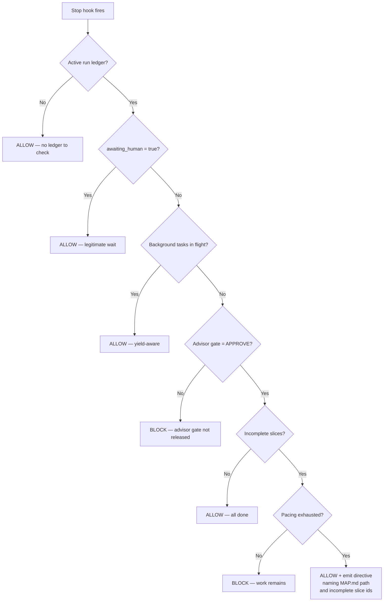

# Stop-Gate Decision Path

> **Type:** flow
> **Related requirements:** [[../../requirements/pacing-r-005-pacing-exhaustion-stop-gate-release-directive-handoff|PACING-R-005]], [[../../requirements/pacing-r-010-milestone-signoff-composes-with-awaiting-human|PACING-R-010]]

## Flow description

The `stop-gate.mjs` Stop hook fires on every session-end attempt. It inspects the active run ledger and decides whether to block the session from ending, allow it, or release it with a directive.

## Decision tree (from `hooks/stop-gate.mjs`)

> **Note:** This diagram is derived from the source logic in `hooks/stop-gate.mjs` and the requirements in PACING-R-005. If the source code is updated, regenerate this diagram from it — do not treat this note as authoritative over the code.

## Pacing exhaustion release path

When pacing is exhausted AND incomplete slices remain, the Stop hook takes the release path (exits 0) and emits a **directive** — not an advisory — instructing the operator to:

1. Run the handoff skill
2. Open a new session
3. Resume the named incomplete slices (by id) in the context of the named motive MAP.md

This resolves the deadlock: pacing blocks starting new work, but the stop-gate must not also block session end — doing so would strand the session with no exit.

## Pacing grant surfacing

When the Stop hook allows a session to end and `pacing.grant` is present in the active ledger, the hook emits a non-blocking summary line stating the grant's range, reason, and granted_by session. See [[../../requirements/pacing-r-006-autopilot-grant-requires-nonempty-reason|PACING-R-006(c)]].

## Milestone + awaiting_human composition

When `pacing.policy = "milestone"` and the milestone gate is pending, the orchestrator can set `awaiting_human = true` via `ledger await-human`. The Stop hook respects this: it suppresses the block nag but does NOT release the milestone gate. See [[../../requirements/pacing-r-010-milestone-signoff-composes-with-awaiting-human|PACING-R-010]].
