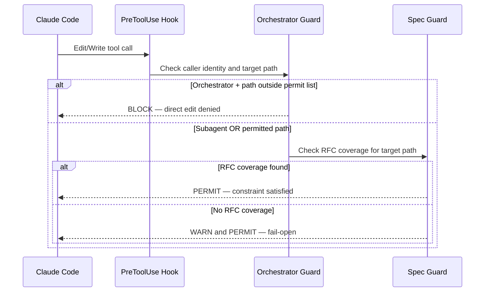

# Enforcement Hook Flows

The orchestrator impl-guard performs a hard block when it detects an orchestrator identity writing to a path outside the two permitted shapes (session memory files and handoff documents); this is a synchronous deny that never reaches the model. The spec guard and nesting guard are advisory: when coverage cannot be determined or depth signals are absent, both guards fail-open and emit a warning without blocking, preserving liveness over strictness.
