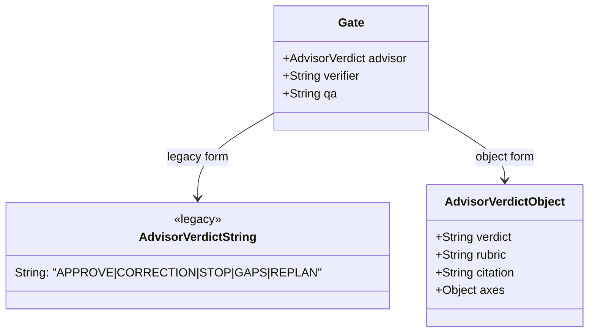

# Gate Note

> **Component page.** Anatomy, variants (advisor verdicts), states, field specs, and usage for the `gate` object in the run ledger. For the gate's decision logic, see [[../flows/stop-gate-decision-path]].

---

## Anatomy

The `gate` object lives at the top level of the run ledger alongside `slices[]`. It records verdicts from named reviewers.



The `gate` object is **additive** — additional gate names beyond `advisor`, `verifier`, and `qa` are permitted (`additionalProperties: true`).

---

## Variants — advisor verdicts

| Verdict | Meaning | Does it satisfy the stop-gate? |
|---------|---------|-------------------------------|
| `APPROVE` | Work is complete and correct | **Yes** — only verdict that releases |
| `CORRECTION` | Specific corrections required | No |
| `STOP` | Fundamental issue, stop proceeding | No |
| `GAPS` | Coverage gaps identified | No |
| `REPLAN` | Plan must be revised | No |

The stop-gate reads either the legacy string form (`"APPROVE"`) or the object form (`{ "verdict": "APPROVE", ... }`) via the `advisorVerdict()` helper in `stop-gate.mjs`.

---

## Field specs

_Derived from `schemas/run-ledger.schema.json` and the `advisorVerdict()` helper in `stop-gate.mjs`._

**`gate.advisor` — string form (legacy):**

| Field | Type | Values |
|-------|------|--------|
| `advisor` | string | `"APPROVE" \| "CORRECTION" \| "STOP" \| "GAPS" \| "REPLAN"` |

**`gate.advisor` — object form:**

| Field | Type | Required | Notes |
|-------|------|----------|-------|
| `verdict` | string | Yes | One of the five verdicts above |
| `rubric` | string | No | Justification text |
| `citation` | string | No | Evidence reference |
| `axes.correctness` | number | No | 0–1 score |
| `axes.completeness` | number | No | 0–1 score |
| `axes.over_engineering` | number | No | 0–1 score |

**`gate.verifier` and `gate.qa`:**

| Field | Type | Values |
|-------|------|--------|
| `verifier` | string | Free-form status string |
| `qa` | string | Free-form status string |

---

## States

| State | How to reach it | Stop-gate response |
|-------|----------------|-------------------|
| Absent / `pending` | Initial | Blocks (counts as not approved) |
| Non-APPROVE verdict | `advisor()` returned CORRECTION/STOP/etc. | Blocks |
| `APPROVE` (either form) | `gw ledger gate --motive <slug> advisor APPROVE --token <write_token>` | **Releases** (if slices also complete) |

---

## Usage

**Record an APPROVE verdict (orchestrator only):**
```
gw ledger gate --motive <slug> advisor APPROVE --token <write_token>
```

With citation and rubric (object form — stored by the ledger CLI):
```
gw ledger gate --motive <slug> advisor APPROVE \
  --token <write_token> \
  --citation "test/slice-s1.test.ts — 41 pass" \
  --rubric "All ACs verified against source; no parity gaps found"
```

> The `write_token` is printed at `bin/ledger init` and re-surfaced in the SessionStart injection. Never pass it to subagents.

---

## Related notes

- [[../concepts/stop-gate]] — what the gate is and its four guarantees
- [[../flows/stop-gate-decision-path]] — how the gate reads this object
- [[run-ledger-slice]] — the sibling data structure checked alongside the gate
- [[../recipes/release-stop-gate-after-advisor-approve]] — step-by-step to close a run
- [[../reference/ledger-cli-reference]] — `gate` command row
