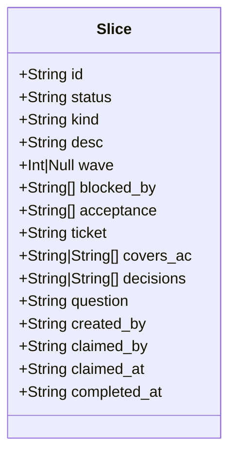

# Run-Ledger Slice

> **Component page.** Anatomy, variants, states, field specs, usage, and related. For the lifecycle state machine, see [[../flows/slice-lifecycle]].

---

## Anatomy

![[assets/run-ledger-slice-anatomy.svg]]

A slice is a JSON object stored inside `slices[]` of the run ledger file (`.groundwork/runs/<session_id>.json`). Its minimum shape is `{ id, status }`.



---

## Variants — kinds

| Kind | When to use | Acceptance criteria | Exempt from pacing? |
|------|-------------|--------------------|--------------------|
| `impl` | Standard implementation work | Required (best practice) | No |
| `plan` | Decomposition, interview output | Optional | Yes |
| `design` | Architecture, UX, design decisions | Optional | Yes |
| `diagnose` | Root-cause investigation | Optional | Yes |
| `fog` | Open question, unresolvable now | Must not have | Yes |

Missing `kind` defaults to `impl` at runtime.

---

## States

| Status | Meaning | Token required to enter? | Terminal? |
|--------|---------|-------------------------|----------|
| `pending` | Registered, not yet started | No | No |
| `in_progress` | Claimed by a subagent | No (but pacing + blocked_by checked) | No |
| `complete` | Done, accepted | **Yes** | Yes |
| `skipped` | Intentionally dropped | **Yes** | Yes |

The stop-gate considers `complete` and `skipped` as non-blocking. Any other status contributes to the incomplete count that can block session end.

---

## Field specs

_Derived from `schemas/run-ledger.schema.json`. "Source fn" column refers to the ledger.mjs command that writes the field._

| Field | Type | Required | Constraints | Source fn |
|-------|------|----------|-------------|-----------|
| `id` | string | **Yes** | Unique within run | `add()` |
| `status` | enum | **Yes** | `pending \| in_progress \| complete \| skipped` | `claim()`, `complete()`, `set()` |
| `kind` | enum | No | `plan \| diagnose \| design \| impl \| fog` — defaults to `impl` | `add()`, `fog()` |
| `question` | string | No | Only meaningful when `kind === "fog"` | `fog()` |
| `desc` | string | No | Human-readable label | `add()` |
| `wave` | integer or null | No | Absent on legacy slices | `add()` |
| `blocked_by` | string[] | No | Referenced ids; referential integrity not schema-enforced | `add()` |
| `acceptance` | string[] | No | Observable outcome strings; not machine-evaluated | `add()` |
| `ticket` | string | No | Pattern: `^[a-zA-Z0-9][a-zA-Z0-9_-]*$` — no path, no `.md` suffix | `add()` |
| `created_by` | string | No | Free-form agent/scope identifier | `add()` |
| `covers_ac` | string or string[] | No | Which AC<n> labels this slice covers | `add()` |
| `decisions` | string or string[] | No | Decision ids (e.g. `"D-40"`) — no referential check | `add()` |
| `claimed_by` | string | No | Set on `in_progress` transition; cleared on terminal | `claim()` |
| `claimed_at` | ISO string | No | Set on `in_progress` transition | `claim()` |
| `completed_at` | ISO string | No | Set on `complete` | `complete()` |

---

## Usage

**Minimal slice (implementation):**
```
gw ledger add --motive <slug> S1 --desc "Add ticket storage" --wave 1 --acceptance "ticket id persists across restart"
```

**Slice linked to a ticket and AC:**
```
gw ledger add --motive <slug> S2 \
  --desc "Wire auth middleware" \
  --wave 2 \
  --blocked-by S1 \
  --ticket auth-design \
  --covers-ac "AC1,AC2" \
  --acceptance "401 returned on missing token; 403 on expired token"
```

**Fog slice (open question):**
```
gw ledger fog --motive <slug> Q1 --desc "Retry policy TBD" --question "What retry interval suits the stop-gate hook?"
```

See [[../recipes/add-slice-with-acceptance-criteria]] for a full walkthrough.

---

## Related requirements

- [[../../requirements/orchestration-r-002-ledger-fog-slice-tracks-open-questions-without-blocking-frontier|R-002]] — fog slice must not block frontier
- [[../../requirements/orchestration-r-003-authorship-duties-for-ticket-sections|R-003]] — ticket field links to authorship duties

## Related notes

- [[gate-note]] — the `gate` object that accompanies slices in the ledger
- [[../flows/slice-lifecycle]] — state machine
- [[../flows/stop-gate-decision-path]] — how the gate reads `status`
- [[../reference/ledger-cli-reference]] — full command reference
- [[../concepts/vertical-slice]] — what a slice represents conceptually
