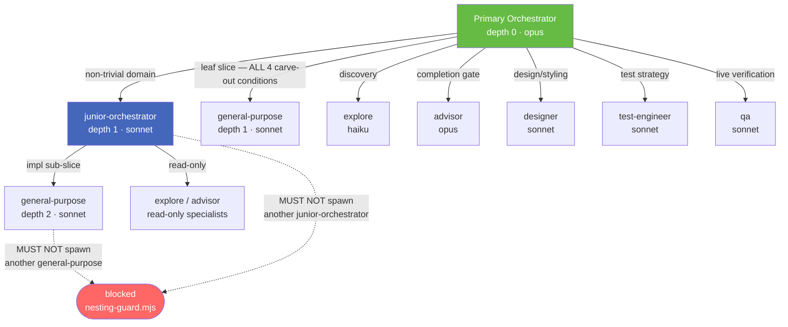

# Delegation Hierarchy

> **Concept note.** This explains *what* the three-level dispatch model is and *why* it is structured this way. For step-by-step how-to guidance, see [[../recipes/add-slice-with-acceptance-criteria]].

---

## Overview

The orchestrator never implements code directly. Every unit of work is dispatched to a specialist subagent at one of two sub-levels. This keeps the orchestrator's context window clear for classification, review, and fan-out decisions.

---

## The three levels

| Level | Agent type | Model | Role |
|-------|-----------|-------|------|
| 0 — Primary orchestrator | `groundwork:orchestrator` | opus | Classifies, decomposes, fans out. MUST NOT implement. |
| 1 — Sub-domain orchestrator | `groundwork:junior-orchestrator` | sonnet | Owns one domain end-to-end. Decomposes into leaf slices. MUST NOT forward 1:1. |
| 2 — Leaf implementer | `groundwork:general-purpose` | sonnet | Implements its own slice. MUST NOT spawn children. |

Read-only specialists (`explore`, `advisor`, `designer`, `test-engineer`, `qa`) may be spawned at any level; they carry no nesting risk because they do not themselves spawn agents.

---

## When to use `junior-orchestrator` vs `general-purpose` at depth 1

`junior-orchestrator` is the default. Use `general-purpose` only when **all four** leaf-carve-out conditions hold simultaneously:

1. **Single domain** — no sub-domains
2. **≤ 2 files** touched
3. **No internal sequencing** — no step A must complete before step B
4. **Small verification surface** — ≤ 5 QA scenarios, single platform, no real hardware

If any condition fails, dispatch `junior-orchestrator`.

---

## Mechanical enforcement

`hooks/nesting-guard.mjs` runs as a `PreToolUse` hook on every `Agent` / `Task` / `TaskCreate` call. It:

- Identifies the caller's agent type from the session context
- Allows spawns according to the table above
- Blocks `junior → junior` and `general-purpose → general-purpose` at the hook layer
- Emits a `DENIED_AT_DEPTH_1` event on block

The hook is **fail-closed on spawn**: an ambiguous or unrecognized caller is denied, not allowed.

> **Note:** 1:1 forwarding (a junior that simply relays the brief to a single child) is a prose-only rule — the hook cannot detect it. Enforce through review.

---

## Related requirements

- [[../../requirements/orchestration-r-001-orchestrator-delegates-non-trivial-implementation|R-001]] — the orchestrator must delegate all non-trivial implementation
- [[../../requirements/orchestration-r-003-authorship-duties-for-ticket-sections|R-003]] — authorship duties flow through the same delegation model

## Related notes

- [[stop-gate]] — the gate that enforces session completion once slices are done
- [[vertical-slice]] — how work is decomposed before dispatching
- [[../flows/stop-gate-decision-path]] — what happens when the orchestrator tries to end a session
- [[../reference/ledger-cli-reference]] — commands for registering slices
