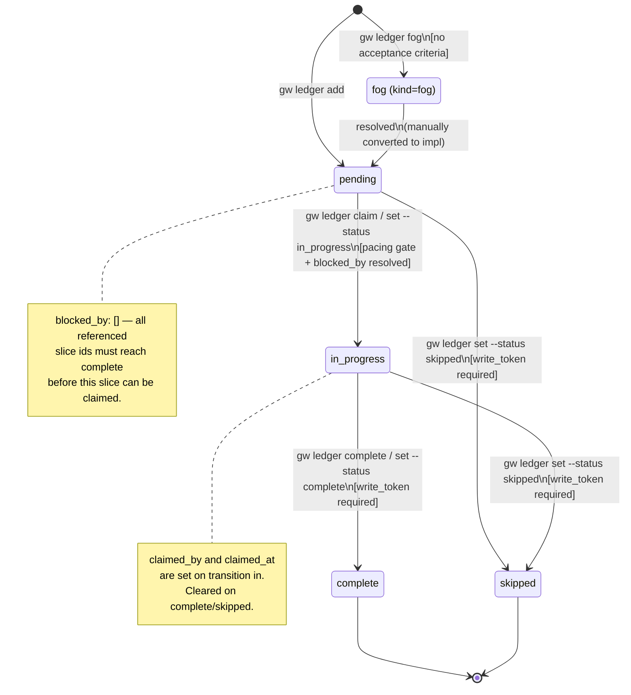

# Slice Lifecycle

> **Flow note.** Traces the state machine a slice moves through from creation to completion. For the data shape, see [[../components/run-ledger-slice]]. For how slices are read by the gate, see [[../flows/stop-gate-decision-path]].

---

## State diagram

_Derived from `KNOWN_SLICE_KEYS`, `TERMINAL_STATUSES`, and the `claim`/`set`/`complete`/`fog` commands in `hooks/ledger.mjs`._



---

## Step table

| Step | Actor | Transition | CLI command | Source function | Token required? |
|------|-------|-----------|-------------|----------------|----------------|
| 1 | Orchestrator | Create slice `pending` | `gw ledger add --motive <slug> <id>` | `add()` in ledger.mjs | No |
| 1a | Orchestrator | Create fog slice | `gw ledger fog --motive <slug> <id> --question "..."` | `fog()` in ledger.mjs | No |
| 2 | Subagent | Claim: `pending → in_progress` | `gw ledger claim --motive <slug> <id>` or `gw ledger set --motive <slug> <id> --status in_progress` | `claim()` / `set()` | No (but blocked by pacing gate and `blocked_by`) |
| 3 | Subagent | Complete: `in_progress → complete` | `gw ledger complete --motive <slug> <id> --token <write_token>` | `complete()` | **Yes** |
| 3a | Orchestrator | Skip: any → `skipped` | `gw ledger set --motive <slug> <id> --status skipped --token <write_token>` | `set()` | **Yes** |
| 4 | Orchestrator | Fog → impl (manual) | Edit `kind` from `fog` to `impl`; add `acceptance` | n/a | n/a |

---

## Invariants

| Invariant | Source |
|-----------|--------|
| Terminal statuses (`complete`, `skipped`) require `write_token` to set | `TERMINAL_STATUSES` constant in ledger.mjs |
| `fog` kind slices are excluded from `ledger frontier` | fog exclusion in `frontier()` |
| `complete` stamps `completed_at` ISO timestamp and `session_id` | `complete()` in ledger.mjs |
| `claimed_by` and `claimed_at` are set on `in_progress` transition | `claim()` in ledger.mjs |
| `blocked_by` is referential by convention only — integrity not schema-enforced | `schemas/run-ledger.schema.json` note |

---

## Pacing gate on claim

When `pacing.policy === "wave"` and the budget is exhausted, `claim` is blocked. `complete` is never blocked by pacing (PACING-R-003). The orchestrator can extend the budget with:

```
gw ledger autopilot --motive <slug> --range N --reason "..." --token <write_token>
```

---

## Related notes

- [[../concepts/vertical-slice]] — what a slice represents
- [[../components/run-ledger-slice]] — full field anatomy and specs
- [[stop-gate-decision-path]] — how the gate reads slice statuses
- [[../recipes/add-slice-with-acceptance-criteria]] — create a slice from scratch
