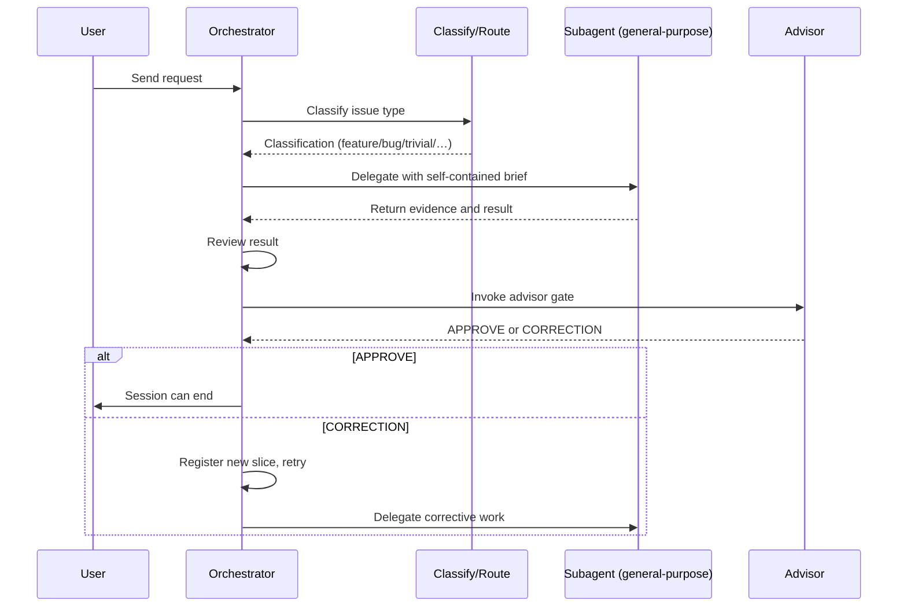

Delegation is mandatory because the orchestrator must stay free of implementation detail; mixing classification with execution collapses the feedback loop that lets the advisor review work objectively. The advisor gate enforces that session end is blocked until an independent reviewer has confirmed the evidence — test output, file paths, and observable behaviour — meets the acceptance criteria, preventing self-certified completion from shipping defects.
