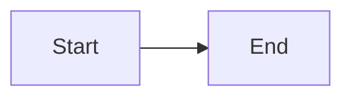

# {{title}}

## Summary

Start with the point: state what the design does and why it matters, in two or three sentences. Link each file you mention as a GitHub permalink pinned to a commit.

## Diagram

Show the flow, architecture, or state machine as a diagram.

## Decisions

Write one entry for each decision that could change a reviewer's yes or no.

- **Choice:** State what you chose.
  **Reason:** State why.
  **Rejected:** State the alternative you did not choose, and why you rejected it.

## Residual risk

State the risk that remains after this design. Delete this section if none remains.
